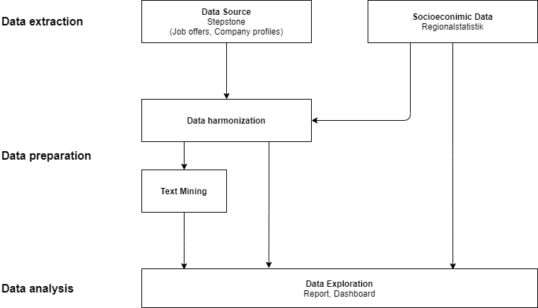

# Stepstone analysis in Python

Within this project, data from different sources (e.g. Stepstone, Regionalstatistik, ...) are collected and prepared for further analysis. In the following sections you can see a project overview. Please note, that every process has it own detailed description, which is provided as *HTML file* or *Jupyter Notebook*.

This project is created by 

* Engelbert Ehret (GitHub: [ehrete](https://github.com/Ehrete))
* Adrian Weiss (GitHub: [SacrumDeus](https://github.com/SacrumDeus))

## Project schedule

### Data extraction

The first step is to select and extract data from our sources. There is on one side [Stepstone](https://www.stepstone.de), which we crawl and on the other side there are socioeconomic data provided from german institutions like [Regionalstatistik](https://www.regionalstatistik.de/genesis/online/).

There are 3 datasets we can retrieve from stepstone: 

* Results for a given job title (e.g. Data Scientist)
* Job offers (links from results page)
* Company profiles (links from results page)

The detailed description for this is available under:

* Markdown file (recommended): [Webscraping](/webscraping.md)
* HTML file: [Webscraping](/webscraping.html)
* ipynb file (Jupyter notebook): [Webscraping](/webscraping.ipynb)

Additional to the data from stepstone we want to select socioeconomic data too. Unfortunatelly, there is no package like *[Wiesbaden for R](https://github.com/sumtxt/wiesbaden/)* to call the endpoints. Therefore we wrote the package on our own. This helped us to extract the required data efficiently. 

A detailed documentation is available at:

* Markdown file (recommended): [Regionalstatistik](/regionalstatistik.md)
* HTML file: [Regionalstatistik](/regionalstatistik.html)
* ipynb file (Jupyter notebook): [Regionalstatistik](/regionalstatistik.ipynb)

### Data preparation

Data preparation affects only data from stepstone, because these data don't have the same structure. Data, which are provided via our *Wiesbaden* module are already structurized. There is no data preparation requiered.

For example, if we extract data from stepstone, there are several structures for the field `Location` available. 

- The first option is, that the field `Location` only provides a string like `Hamburg`. There are no more information provided which helps us to locate either the company or the job. 
- A further option is, that location is populated by `Longitude/Latitude` and an `address string` (for example: `{ longitude: "8.6255502700806", latitude: "50.07878112793", address: "Lyoner Str. 23, 60528 Frankfurt am Main, Deutschland" }`). This format will not work either, because we need the post code to map data with socioeconomic data. Typically it is used within job offers.
- As third format, there is an object of address data (`street, streetnumber, postcode, city,`) but no GPS data. These data are required for data exploration and data analysis. 

It don't have to be said, that those data are sometimes malformatted. There are postcodes in Germany, which are not official. Those postcodes are distributed by *Deutsche Post*/*DHL* for companies, which receive many mailings every day. To avoid issues later in data exploration and data analysis we need to get rid of this malformatted data.

All of required data preparation steps to structure the data and prepare data for text mining are handled by *preprocessing*. For further information, see:

* Markdown file (recommended): [Preprocessing](/preprocessing.md)
* HTML file: [Preprocessing](/preprocessing.html)
* ipynb file (Jupyter notebook): [Preprocessing](/preprocessing.ipynb)

After the data are processed that they will match the same pattern, we start the text-mining process. This process converts any text field (like companyDescription or jobDescription) to a specific format. These data are filtered, because there are many different words in each text field. To compare them, we want to extract only those words, which are listed at least in 50 documents. Additional we created word bigrams (token combinations) and filtered them, if they occure on at least 30 documents.

This process is really important for further analysis. A detailed description of this process is available at:

* Markdown file (recommended): [TextMining](/textMining.md)
* HTML file: [TextMining](/textMining.html)
* ipynb file (Jupyter notebook): [TextMining](/textMining.ipynb)

### Data exploration

After we prepared all data, we want to explore the data to answer some questions:

- What are the requirements for a Data Scientist (based on job offer)?
- What are the characteristics for a Data Scientist?
- Which companies do offer jobs as Data Scientist?
- Are there geografical discrepancies?
- Is there a correlation between job/company location and socioeconomic data?

To see the answers for this questions, forward with:

* Markdown file (recommended): [Data Exploration](/data-exploration.md)
* HTML file: [Data Exploration](/data-exploration.html)
* ipynb file (Jupyter notebook): [Data Exploration](/data-exploration.ipynb)

> A further data exploration (small example) is also available as interactive Dash app. Please follow the instructions linked [here](/dash/start_dash.md) or head to `/dash/start_dash.md`.