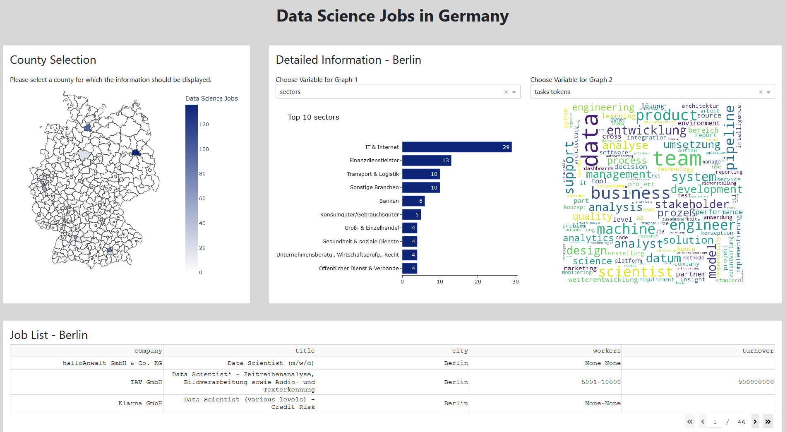

# Dash App

The Dash app enables interactive data analysis at the county level.

## Layout and functionality

The layout of the Dash app is shown in the figure below.

The app consists of three areas:
1.  **Map area** (middle left)
1.  **Graph area** (middle left)
1.  **Job List** (bottom)

A map with the German counties is displayed in the **map area**. The colors of the counties are based on the number of Data Science jobs. 

> The Geojson File used in the map is downloaded from the site [opendatasoft](ps://data.opendatasoft.com/explore/dataset/georef-germany-kreis%40public/export) and simplyfied by using the online tool [Mapshaper](https://mapshaper.org/).

The graphics in the **graph area** (detailed information) and the **job list** contain county data. These areas are updated when the user clicks on a county in the map.

The **graph area** consists of two graphics. The user can select which variable to display in each chart via a dropbox menu.

The Dash app is responsive and therefore works on small screens like smartphones.

## Installation and running

To start the app, the following steps must be performed:

1. Make sure that the following packages are installed:
    *   pandas (1.4.0)
    *   pymongo (4.0.1)
    *   plotly (5.6.0)
    *   dash (2.2.0)
    *   dash_bootstrap_components (1.0.3)
    *   wordcloud (1.8.1)
1. Import the Mongo DB database dump (`data/stepstone-data.zip`) to your Mongo DB database server (`mongorestore`).
1. Go to the `dbConnection.json` file in the Dash folder and check the database connection settings (uri and database name).
1. Open the `dashboard.py` file in the `dash` folder and run it.
