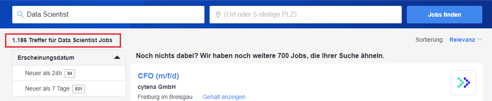
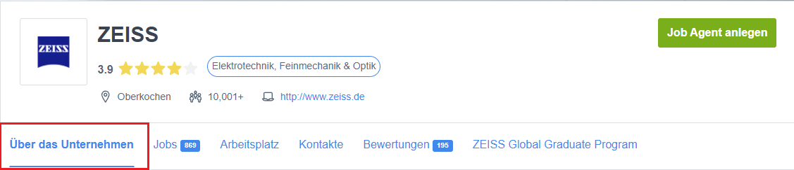
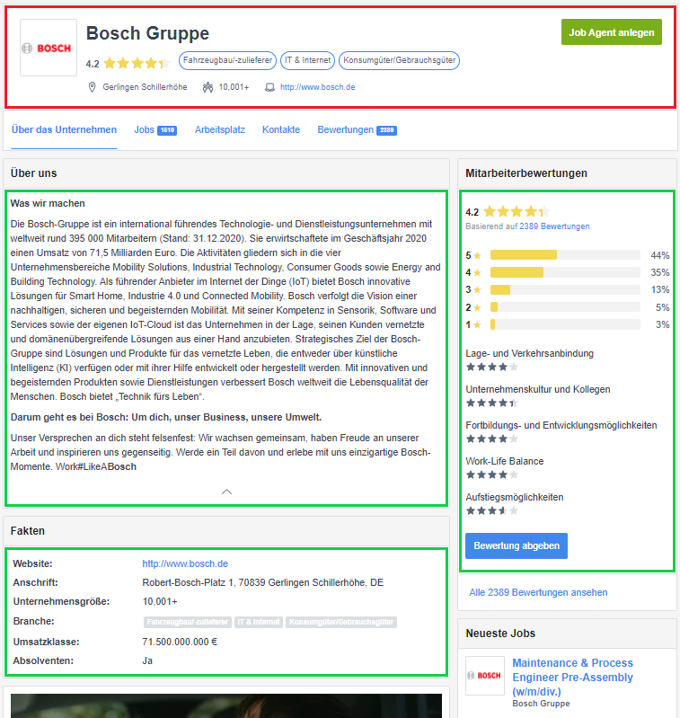

# Webscraping

Author: Engelbert Ehret (GitHub: [ehrete](https://github.com/Ehrete)), Adrian Weiss (GitHub: [SacrumDeus](https://github.com/SacrumDeus))

This part describes the webscraping process to retrieve the data from data source *stepstone*. There are several items which are scraped:
* Stepstone results for a given job (e.g. Data Scientist: https://www.stepstone.de/5/ergebnisliste.html?what=Data%20Scientist)
* Stepstone job description (e.g. Data Scientist: https://www.stepstone.de/stellenangebote--Data-Scientist-m-f-d-Muenchen-80335-IU-Internationale-Hochschule--7256289-inline.html)
* Stepstone company description (e.g. IU Internationale Hochschule: https://www.stepstone.de/cmp/de/IU-Internationale-Hochschule-97654/?intcid=Button_listing_company-card_company-logo)

There are several packages and functions used in this part. Those are listed below:


```python
# packages
import pandas as pd
from pymongo import MongoClient

# custom functions
import webscraperFunctions as crawler
```

## Scrape the search results

We have several jobs, listed below, for which we want to extract data.

Jobs:
* Data Scientist
* Data Engineer
* Data Analyst
* [...]

Stepstone creates a custom URL for each search requests with a structurized pattern. There are keys, which need to be passed to the request:
* `what`: job, e.g. "Data%20Scientist" (translate *spaces* to *%20*)
* `of`: paging, for first request not necessary, for further results necessary. Increment by 25 to retrieve results for next page

No other parameters are required to get the data from this list.

Structure of search request
> `https://www.stepstone.de/5/ergebnisliste.html?what=<what>&of=<of>`

Displays page 1 for searching job "Data Scientist":
> `https://www.stepstone.de/5/ergebnisliste.html?what=Data%20Scientist`

Displays page 2 for searching job "Data Scientist":
> `https://www.stepstone.de/5/ergebnisliste.html?what=Data%20Scientist&of=25`

First, we need to define, which job titles we want to find:


```python
# lets define a list with all jobs to crawl
jobs = ["Data Scientist"]
        
        #"Data Engineer",
        # "Data Analyst"]
```

After we defined the list with jobs, we want to crawl, we call the crawler itself, passing as argument the `jobTitle` (e.g. "Data Scientist").

First, the function creates some variables, which are required to crawl the website:

* jobTitleEncoded: This variable is an encoded string of job (`Data Scientist` -> `Data%20Scientist`)
* numberOfItems: There are a fixed number of items of each results page
* url: The URL of each results page is generated dynamically due processing

After we defined the variables, the total number of results have to determined.



The number of results are provided by an element on each page. The number of results are stored in an element (`<span>`) with an unique class `at-facet-header-total-results`.

```html
<span class="at-facet-header-total-results">1.186</span>
```

Afterwards the complete page is crawled by an function (which is used for each further page (page 2, page 3, ...)), which extracts some data from each results item and stores it in an dictionary. The dictionaries are appended into a list, which is returned from function.

Example of data extracted for each results item: 

```python
{
    'id': '7863612',
    'title': 'Data Scientist (m/f/x)',
    'jobLink': '/stellenangebote--Data-Scientist-m-f-x-Muenchen-ZEISS--7863612-inline.html',
    'company': 'ZEISS',
    'companyLink': 'https://www.stepstone.de/cmp/de/zeiss-3427/jobs'
}
```


```python
# variables
jobList = []

# iterate through jobs
for job in jobs:
    try:
        jobList.extend(crawler.initJobSearch(job))
    except:
        print(job)
```

    [INFO] there are 1178 results for job: Data Scientist
    


```python
print("There are {0} items in total.".format(len(jobList)))
```

    There are 1157 items in total.
    

After running this process we got a list with many items. This list is just a list of each results item, we got from searching and scraping.
Those results must be verified to remove duplicates.


```python
# first -> convert it to dataframe
dfJobList = pd.DataFrame(jobList)

# drop duplicates by column id
dfJobList = dfJobList.drop_duplicates(subset=["id"])

# now we got a pretty job list dataframe
dfJobList
```


<div>
<style scoped>
    .dataframe tbody tr th:only-of-type {
        vertical-align: middle;
    }

    .dataframe tbody tr th {
        vertical-align: top;
    }

    .dataframe thead th {
        text-align: right;
    }
</style>
<table border="1" class="dataframe">
  <thead>
    <tr style="text-align: right;">
      <th></th>
      <th>id</th>
      <th>title</th>
      <th>jobLink</th>
      <th>company</th>
      <th>companyLink</th>
    </tr>
  </thead>
  <tbody>
    <tr>
      <th>0</th>
      <td>7733373</td>
      <td>Data Scientist (m/w/divers)</td>
      <td>https://www.stepstone.de/stellenangebote--Data...</td>
      <td>Nestlé Deutschland AG</td>
      <td>https://www.stepstone.de/cmp/de/nestl%c3%a9-de...</td>
    </tr>
    <tr>
      <th>1</th>
      <td>7930448</td>
      <td>Data Scientist / Analyst (m/w/d)</td>
      <td>https://www.stepstone.de/stellenangebote--Data...</td>
      <td>SPIEGEL-Verlag Rudolf Augstein GmbH &amp; Co. KG</td>
      <td>https://www.stepstone.de/cmp/de/spiegel-verlag...</td>
    </tr>
    <tr>
      <th>2</th>
      <td>7916480</td>
      <td>Data Scientist (m/w/d)</td>
      <td>https://www.stepstone.de/stellenangebote--Data...</td>
      <td>Atruvia AG</td>
      <td>https://www.stepstone.de/cmp/de/atruvia-ag-275...</td>
    </tr>
    <tr>
      <th>3</th>
      <td>7928772</td>
      <td>Data Scientist (m/w/d)</td>
      <td>https://www.stepstone.de/stellenangebote--Data...</td>
      <td>halloAnwalt GmbH &amp; Co. KG</td>
      <td>https://www.stepstone.de/cmp/de/halloanwalt-gm...</td>
    </tr>
    <tr>
      <th>4</th>
      <td>7753406</td>
      <td>Principal Data Scientist (m/w/d)</td>
      <td>https://www.stepstone.de/stellenangebote--Prin...</td>
      <td>ONE LOGIC GmbH</td>
      <td>https://www.stepstone.de/cmp/de/one-logic-gmbh...</td>
    </tr>
    <tr>
      <th>...</th>
      <td>...</td>
      <td>...</td>
      <td>...</td>
      <td>...</td>
      <td>...</td>
    </tr>
    <tr>
      <th>1152</th>
      <td>7820351</td>
      <td>Sales Manager Automation Solutions (m/f/d)</td>
      <td>https://www.stepstone.de/stellenangebote--Sale...</td>
      <td>cytena GmbH</td>
      <td>https://www.stepstone.de/cmp/de/cytena-gmbh-15...</td>
    </tr>
    <tr>
      <th>1153</th>
      <td>7846707</td>
      <td>Supply Chain Team Leader (m/f/d)</td>
      <td>https://www.stepstone.de/stellenangebote--Supp...</td>
      <td>Dispendix GmbH</td>
      <td>https://www.stepstone.de/cmp/de/dispendix-gmbh...</td>
    </tr>
    <tr>
      <th>1154</th>
      <td>7810405</td>
      <td>Product Manager Biopharma &amp; Single-Cell Clonin...</td>
      <td>https://www.stepstone.de/stellenangebote--Prod...</td>
      <td>cytena GmbH</td>
      <td>https://www.stepstone.de/cmp/de/cytena-gmbh-15...</td>
    </tr>
    <tr>
      <th>1155</th>
      <td>7906323</td>
      <td>Project Manager of the PUNCH4NFDI Consortium i...</td>
      <td>https://www.stepstone.de/stellenangebote--Proj...</td>
      <td>Deutsches Elektronen-Synchrotron DESY</td>
      <td>https://www.stepstone.de/cmp/de/deutsches-elek...</td>
    </tr>
    <tr>
      <th>1156</th>
      <td>7835802</td>
      <td>Lead of Pharmacovigilance Database Management ...</td>
      <td>https://www.stepstone.de/stellenangebote--Lead...</td>
      <td>Daiichi Sankyo Europe GmbH</td>
      <td>https://www.stepstone.de/cmp/de/daiichi-sankyo...</td>
    </tr>
  </tbody>
</table>
<p>1155 rows × 5 columns</p>
</div>


## Scrape the company profiles

For further processing we want to extract the company profiles for each company.

To achieve this, we only need distinct company values (or we will get many duplicates).


```python
# extract distinct companies
dfCompanies = dfJobList.drop_duplicates(subset=["company"])[["company", "companyLink"]]

# convert it to list
companyList = dfCompanies.to_dict('records')

# how many distinct companies did we get?
print("There are {0} distinct companies.".format(len(companyList)))
```

    There are 576 distinct companies.
    

Now we apply a function on each entry, which extracts the data from each company page given. This function tries to extract as much data as possible. Limits are given by each company description. If the advertising company provides an "Über das Unternehmen" (markred in red) area, we are going to crawl this about page. If not, we crawl at least the header of each company.



If we are using the "Über das Unternehmen" link, there are much more information provided. If those page is not available, we can only extract data from the header are. In the picture below, the header area is marked in red. This are is shared between each area. If available, we are trying to extract the data, which are highlighted in green in the picture.



After executing the function, we get a dictionary returned, which is structurized as described below:

```python
{
    'company': 'Generali Deutschland AG', 
    'linkJobs': 'https://www.stepstone.de/cmp/de/Bosch-Gruppe-2804/jobs.html', 
    'linkProfile': 'https://www.stepstone.de/cmp/de/Bosch-Gruppe-2804/uber-das-unternehmen.html#menu', 
    'id': '2804', 
    'sectors': [{'sectorId': 10000, 'name': 'Fahrzeugbau/-zulieferer'}, 
                {'sectorId': 21000, 'name': 'IT & Internet'}, 
                {'sectorId': 11000, 'name': 'Konsumgüter/Gebrauchsgüter'}], 
    'workers': '10,001+', 
    'homepage': 'http://www.bosch.de',
    'about': ..., 
    'location': {
        'street': 'Robert-Bosch-Platz', 
        'streetNumber': '1', 
        'postalCode': '70839', 
        'city': 'Gerlingen Schillerhöhe', 
        'country': 'DE'
    }, 
    'rating': {
        'overall': 2389, 
        'avgRating': 4.18555, 
        'participation': {
            '1': 80, 
            '2': 136, 
            '3': 300, 
            '4': 829, 
            '5': 1044
        }, 
        'subrating': {
            'office': 4.11181, 
            'culturePeople': 4.14897, 
            'trainingDevelopment': 4.03582, 
            'workLifeBalance': 4.04646, 
            'career': 3.78281
            }
        }, 
        'json': {
            'Header': { ... },
            'Rating': { ... },
            'Facts': { ... }
        }
}
```

This dictionary is appended to a list, which is stored later in MongoDb


```python
# variables
companyData = []

# iterate through companies
for company in companyList:
    try:
        companyData.append(crawler.getCompanyData(company))
    except:
        # items, occuring here have to processed manually. There are issues, which cause not han
        print(company)
```

    {'company': 'Versicherungskammer Bayern', 'companyLink': 'https://www.stepstone.de/cmp/de/versicherungskammer-bayern-55725/jobs'}
    {'company': 'Workwise GmbH', 'companyLink': 'https://www.stepstone.de/cmp/de/workwise-gmbh-191177/jobs'}
    {'company': 'ARRK Engineering GmbH', 'companyLink': 'https://www.stepstone.de/cmp/de/arrk-engineering-gmbh-2718/jobs'}
    {'company': '365FarmNet Group KGaA mbH & Co KG', 'companyLink': 'https://www.stepstone.de/cmp/de/365farmnet-group-kgaa-mbh-%26-co-kg-229183/jobs'}
    {'company': 'Generali Deutschland AG', 'companyLink': 'https://www.stepstone.de/cmp/de/generali-deutschland-ag-7012/jobs'}
    

Within the data, there is a field hidden, which categorizes the company by industrial sectors (e.g. Banking or Retail).

Lets extract those data and create a dictionary. To achieve this, there is not that much code required.


```python
sectorItems = []

# get column sectors from company data
sectors = pd.DataFrame(companyData)[["sectors"]]

# remove empty columns and duplicates
sectors = sectors.dropna()

# unfortunately the data are provided as string like '[{id: name}, {id: name}, ...]
# to achieve this, we convert it to list
sectors = sectors.to_dict("records")

# process every sector entry
for sector in sectors:

    # iterate over sector elements
    for elem in sector["sectors"]:

        if elem not in sectorItems:
            sectorItems.append(elem)
```

Below are 5 examples displayes, which we extracted for sectors:


```python
print(sectorItems[:5])
```

    [{'sectorId': 3000, 'name': 'Nahrungs- & Genussmittel'}, {'sectorId': 6000, 'name': 'Medien (Film, Funk, TV, Verlage)'}, {'sectorId': 19001, 'name': 'Banken'}, {'sectorId': 21000, 'name': 'IT & Internet'}, {'sectorId': 31000, 'name': 'Sonstige Branchen'}]
    

## Scrape the job ad

After we collected all data from the companies who placed an job ad, we want to crawl the data for each job ad. There are several areas, we want to extract. Those are marked in the picture below.


Returned from this function is a dict, which is appended to a list. The structure of this job offer is described below:

```python
{
    'id': '7562425', 
    'link': 'https://www.stepstone.de/stellenangebote--Data-Engineer-Computer-Vision-f-m-div-Leonberg-Bosch-Gruppe--7562425-inline.html', 
    'company': 'Bosch Gruppe', 
    'jobTitle': 'Data Engineer Computer Vision (f/m/div.)', 
    'location': {
        'longitude': '9.1833000183105', 
        'latitude': '48.766700744629', 
        'address': 'Wiener Straße 42, 70469 Stuttgart, Germany'
    }, 
    'contractType': 'Feste Anstellung', 
    'workType': 'Vollzeit', 
    'introduction': ..., 
    'tasks': ..., 
    'applicantProfile': ..., 
    'companyOffer': ..., 
    'benefits': [
        'Vorsorgeuntersuchungen', 
        'Betriebliche Altersvorsorge', 
        'Sportaktivitäten', 
        'Flexible Arbeitszeiten', 
        'Fitnessangebote', 
        'Parkplatz', 
        'Mitarbeiterrabatte', 
        'Kantine', 
        'Kinderbetreuung', 
        'Betriebsarzt', 
        'Coaching', 
        'Homeoffice'
    ], 
    'store': {
        'header': <html>, 
        'introduction': <html>, 
        'tasks': <html>,
        'applicantProfile': <html>, 
        'companyOffer': <html>, 
        'location': { ... }, 
        'benefits': [ ... ]
    }
}
```

There is no relevance to check for duplicates, because this happened after we extracted all job offerings for a distinct job title


```python
# variables
jobData = []

# iterate through companies
for job in jobList:
    try:
        jobData.append(crawler.getJobData(job["jobLink"], job["id"]))
    except:
        print(job)
```

Within the job detail data, there is a field, which could be interesting to investigate: *Job benefits*. To achieve this, we are going to extract this field from data to store it separatly.

The data we gathered is going to be stored in a MongoDB which allows us to store structure less data. This is described in the next part.


```python
# variables
benefits = []

# iterate over jobs and extract benefits
for job in jobData:

    if job["benefits"]:

        for benefit in job["benefits"]:

            # append benefit to benefits list if benefit not already in benefits lis
            if benefit not in benefits:
                benefits.append(benefit)

# convert list to dict
benefits = [{"benefit": benefit} for benefit in benefits]
```

Those benefits are listed below:


```python
print(benefits)
```

    [{'benefit': 'Betriebliche Altersvorsorge'}, {'benefit': 'Sportaktivitäten'}, {'benefit': 'Flexible Arbeitszeiten'}, {'benefit': 'Fitnessangebote'}, {'benefit': 'Firmenevents'}, {'benefit': 'Parkplatz'}, {'benefit': 'Mitarbeiterrabatte'}, {'benefit': 'Sabbatical'}, {'benefit': 'Kantine'}, {'benefit': 'Kinderbetreuung'}, {'benefit': 'Coaching'}, {'benefit': 'Homeoffice'}, {'benefit': 'Vorsorgeuntersuchungen'}, {'benefit': 'Essenszulage'}, {'benefit': 'Firmenhandy'}, {'benefit': 'Betriebsarzt'}, {'benefit': 'Aktienoptionen'}, {'benefit': 'Hunde erlaubt'}, {'benefit': 'Barrierefreiheit'}, {'benefit': 'Gute Verkehrsanbindung'}, {'benefit': 'Balkon'}, {'benefit': 'Mitarbeiter-Laptop'}, {'benefit': 'Studienförderung'}, {'benefit': 'Firmenwagen'}, {'benefit': 'Firmenticket'}, {'benefit': 'Tankkarte'}, {'benefit': 'Zusätzliche Urlaubstage'}, {'benefit': 'Kfz-/Reisezulage'}, {'benefit': 'Zahnvorsorge'}]
    

## Store data in MongoDb

Let's connect first to the MongoDb and initialize the database and the collections.

The database name will be `stepstone-data`. Unless the collections do not exist, we will create multiple collections to store data such as `companyData`, `benefits` or `sections`.

MongoDb is hosted locally.


```python
# connect to db
client = MongoClient("mongodb://localhost:27017/")

# create/connect to database
database = client["stepstone-data"]

# create/connect collections (do prevent duplicate data)
dbBenefits = database["benefits"]
dbCompanies = database["companies"]
dbJobs = database["jobs"]
dbResults = database["results"]
dbSectors = database["sectors"]

# delete data if collection has data
if dbBenefits.count_documents({}) > 0:
    dbBenefits.delete_many({})
if dbCompanies.count_documents({}) > 0:
    dbCompanies.delete_many({})
if dbJobs.count_documents({}) > 0:
    dbJobs.deleteMany({})
if dbResults.count_documents({}) > 0:
    dbResults.deleteMany({})
if dbSectors.count_documents({}) > 0:
    dbSectors.delete_many({})

# store data
dbBenefits.insert_many(benefits)
dbCompanies.insert_many(companyData)
dbJobs.insert_many(jobData)
dbResults.insert_many(jobList)
dbSectors.insert_many(sectorItems)
```


    <pymongo.results.InsertManyResult at 0x1eb9c60df00>


